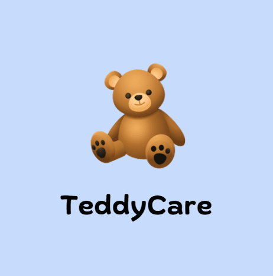

  

<a href="https://teddycare.vercel.app/">
  <h1 align="center">TeddyCare</h1>
</a>

  An AI-powered healthcare assistant built with Next.js, the Vercel AI SDK, OpenAI, and Vercel KV.

  <a href="#features"><strong>Features</strong></a> ·
  <a href="#model-providers"><strong>Model Providers</strong></a> ·
  <a href="#deploy-your-own"><strong>Deploy Your Own</strong></a> ·
  <a href="#running-locally"><strong>Running locally</strong></a> ·
  <a href="#authors"><strong>Authors</strong></a>

 

## Features

- [Next.js](https://nextjs.org) App Router
- React Server Components (RSCs), Suspense, and Server Actions
- [Vercel AI SDK](https://sdk.vercel.ai/docs) for streaming chat UI
- Support for OpenAI (default) with custom fine-tuned model
- [shadcn/ui](https://ui.shadcn.com)
  - Styling with [Tailwind CSS](https://tailwindcss.com)
  - [Radix UI](https://radix-ui.com) for headless component primitives
  - Icons from [Phosphor Icons](https://phosphoricons.com)
- Chat History, rate limiting, and session storage with [Vercel KV](https://vercel.com/storage/kv)
- [NextAuth.js](https://github.com/nextauthjs/next-auth) for authentication
- Integration with Terra API for health data

## Model Providers

This project uses a custom fine-tuned OpenAI model (`rohan/tune-gpt-4o`) as the default. The model is tailored to provide healthcare-specific responses for both doctors and patients.

## Deploy Your Own

You can deploy your own version of TeddyCare to Vercel with one click:

## Creating a KV Database Instance

Follow the steps outlined in the [quick start guide](https://vercel.com/docs/storage/vercel-kv/quickstart#create-a-kv-database) provided by Vercel. This guide will assist you in creating and configuring your KV database instance on Vercel, enabling your application to interact with it.

Remember to update your environment variables (`KV_URL`, `KV_REST_API_URL`, `KV_REST_API_TOKEN`, `KV_REST_API_READ_ONLY_TOKEN`) in the `.env` file with the appropriate credentials provided during the KV database setup.

## Running locally

You will need to use the environment variables [defined in `.env.example`](.env.example) to run TeddyCare. It's recommended you use [Vercel Environment Variables](https://vercel.com/docs/projects/environment-variables) for this, but a `.env` file is all that is necessary.

> Note: You should not commit your `.env` file or it will expose secrets that will allow others to control access to your various OpenAI and authentication provider accounts.

1. Install Vercel CLI: `npm i -g vercel`
2. Link local instance with Vercel and GitHub accounts (creates `.vercel` directory): `vercel link`
3. Download your environment variables: `vercel env pull`
